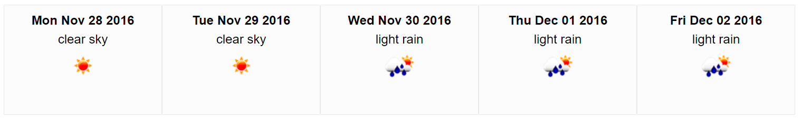

# ES6 Weather Forecast
ES6 Weather Forecast in JavaScript using EcmaScript 6 (2015).
Looks like this:


Demo [here](http://josequinto.com/forecast/index.html)


## Features
- [ES6](http://es6-features.org) (with [babel](https://babeljs.io))
- [SCSS](http://sass-lang.com)
- Hot Module Replacement for faster development
- Axios as promise based HTTP Client. Read this [Fetch vs Axios comparison](https://github.com/mzabriskie/axios/issues/314)
- [Forecast API](http://openweathermap.org/forecast5)
- Responsive design
- Mock Data allowing working offline and saving calls to weather API
- Webpack
    - [Webpack-dev-server](https://webpack.js.org/how-to/develop/#webpack-dev-server)
    - Webpack development environment configuration
    - Webpack Babel loader configuration
    - Webpack SCSS configuration
    - [Webpack configuration for HMR](https://webpack.js.org/how-to/hot-module-reload)
    - Webpack production configuration
         - Split out css files (two threads, JS and CSS) using [ExtractTextPlugin](https://github.com/webpack/extract-text-webpack-plugin) 
         - [UglifyJsPlugin with options](https://github.com/webpack/webpack/blob/v1.13.3/lib/optimize/UglifyJsPlugin.js)
         - Use include in the loader instead of the exclude. [More info](http://stackoverflow.com/questions/37823764/how-include-and-exclude-works-in-webpack-loader)
         - More perfomance tips: [here](https://medium.com/@khanght/optimize-webpack-production-build-ec594242b222#.bj3eyg65p)

<br />

### Features NOT INCLUDED (with more time...)
- TDD. Configure Test Driven Development environment. Mocha, Chai, or Jest...
- Create React component as well
- Add a selector of Locations to allow the user to select more Locations (not only London)
- Improve the design
- Add more information about clouds, wind, etc...
- Even if that is responsive (i used float divs) it could be targeted with media queries and the mobile user experience could be improved.
- Initial Spinner meanwhile the app is doing the query to weather API
- Add the results to sessionStorage cache


<br /><br />
## Getting Started
### Install pre-requisites
- Node.js and NPM: [Download and install](https://nodejs.org/). *I have version 6.6.0 of Node and 3.10.6 of NPM on Windows PC*
- Git: [Download and install](https://git-scm.com/). *I have version 2.7.4 installed on Windows PC*


### Clone Repo
1. Get the url of your forked project.
    - Go to https://github.com/username/es6-weather-forecast
2. Click on **"Clone or download"** and Copy to clipboard the url ending on .git.
3. Open your command line and go to your directoy  
*You don't need to create a specific folder for the project, it will be created by git*
4. Clone the repo on your machine:
```
$ git clone https://github.com/username/es6-weather-forecast
```  
*Note: That will create a new folder called es6-weather-forecast with all the files in.*


### Install Project dependencies
We will use npm i to install all our dependencies in our node_modules folder.

```
$ cd es6-weather-forecast  
$ npm i
```


### Run the app in Development mode
```
$ npm run start
```

### Build
```
$ npm run build
```

### Lint
```
$ npm run lint
```


<br /><br />
## Contributing
Please feel free to add your own improvement. I am waiting your Pull Request (PR).

## License
MIT License
Copyright (c) 2016 Jose Quinto Zamora
